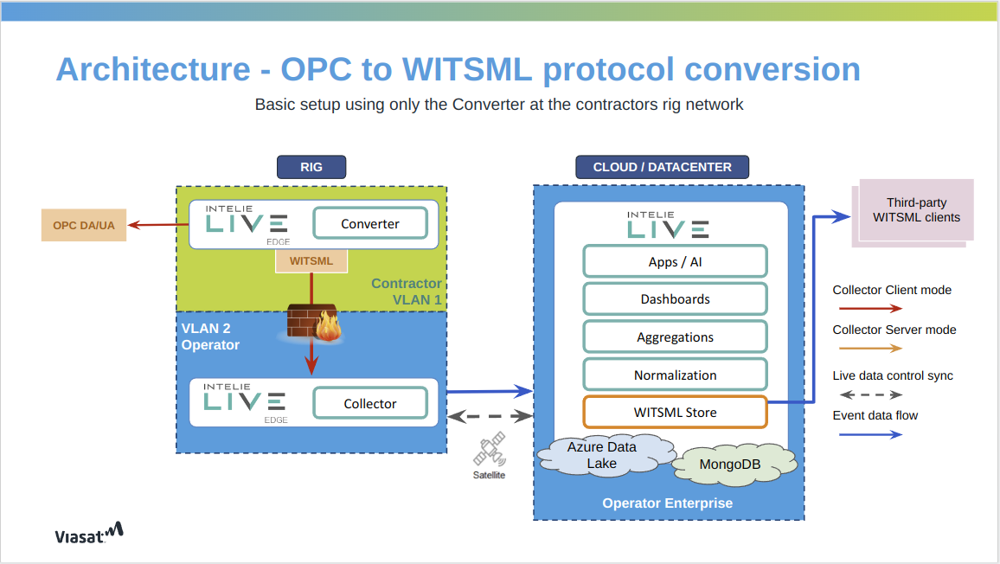

# Protocol conversion

The collector is also designed to act as a protocol converter, that is, it can read the data in OPC-DA or OPC-UA format
and deliver it on WITSML format. That action could be performed in any deployed instance.



The OPC to WITSML conversion works by running a basic WITSML server backed by a PostgreSQL database, where the Live Rig
Collector will query the OPC server and expose its data as an WITSML server.

To configure this feature, you need to configure an OPC-DA or OPC-UA Source on the LiveRig Collector. For more
information,
see the [OPC-DA](./protocols/opc-da.md) or [OPC-UA](./protocols/opc-ua.md) pages, along with
the [sources.xml](./configuration/sources.xml.md)
and [store.json](./configuration/store.json.md) pages for file configurations.

The [store.json](./configuration/store.json.md) file contains 4 fields exclusively for the OPC to WITSML conversion
feature.
These are: `database`, `endpoint`, `limit` and `purge`.

### Database

The `database` field is required for connecting to the local PostgreSQL database used in the conversion. *Example:*

```json
"database": {
"url": "jdbc:postgresql://localhost:5432/?user=root&password=rootpassword"
}
```

### Endpoint

The `endpoint` field is necessary for exposing an WITSML Server endpoint with the collected data. *Example:*

```json
"endpoint": "http://127.0.0.1:1234/witsml/store"
```

### Limit

The `limit` field is not a necessary field. Its purpose is to limit the number of values to be returned on a request to
the WITSML store.
The default value is `1000`.

### Purge

The `purge` field is not a necessary field. Its purpose is to set a period to purge old values from the WITSML store (to
avoid the collector's disk filling up).
This is calculated using the following formula: `CURRENT_TIMESTAMP - PURGE_INTERVAL`. This interval is used in seconds.
*Example:*
If the `purge` field value is `1000`, that means that values older than 1000 seconds from the current time will be
deleted.
The default state of this feature is `off`.

After configuring the OPC to WITSML conversion an WITSML server endpoint will be created. With this new endpoint you can
configure a new [WITSML](./protocols/witsml.md) Source at a LiveRig Collector or use a WITSML Store for fetching data.


When used in pure protocol conversion mode, the collector does not need the presence of a centralized Intelie Live
environment.

